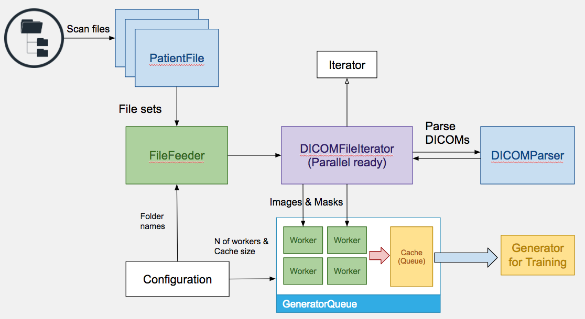

# vessel

A package for preparing DICOM data. It provides a `QueueGenerator` which leverage multiple CPU cores to accelarate DICOM file loading.

## Structure of package
    - data                      Data folder (not included in this repo)
        - contourfiles          Different folder name should also config into configuration.py
            - SC-HF-I-1
                - i-contours
                - o-contours
        - dicoms
        - links.csv
    - vessel                    main package source code
        - configuration.py      Configuration file, define numbers of workers and cache size.
        - parser.py             parser for DICOM and contour files
        - preprocess.py         general settings
        - utils.py              contains `Iterator` and `QueueGenerator`
    - test
        filefeeder_unittest.py  unit test for FileFeeder
        generator_example.py    An example of use this package
        parser_unittest.py      unit test for parser
        reader_unittest.py      unit test for parallel generator
    - logs                      some test logs
    vessel.ipynb                Jupyter notebook: some experiments results
    setup.py
    

## Architecture


## How to use
### Installation
```bash
    git clone https://github.com/JMHOO/vessel.git
    pip3 install -e vessel
```  

### example of GeneratorQueue (parallelized loading)
```python
    from vessel.preprocess import FileFeeder, DICOMFileIterator
    from vessel.utils import GeneratorQueue
    # set basic rule to mimic training
    batch_size = 12
    epochs = 2
    # create file feeder, 'data' is the directory contains DICOMs and contours
    feeder = FileFeeder('data')
    n_of_samples = len(feeder)
    steps_of_epoch = n_of_samples / batch_size

    # generator to generate ([pixel_data], [mask])
    generator = DICOMFileIterator(x=feeder.files(), batch_size=batch_size)
    try:
        # use GeneratorQueue to parallel generator
        queue = GeneratorQueue(generator=generator)
        queue.start()
        # output is our new generator
        output = queue.fetch()

        epoch = 0
        while epoch < epochs:
            steps = 0
            print("Epoch-{}".format(epoch))
            while steps < steps_of_epoch:
                x, y = next(output)
                current_batch_size = x.shape[0]
                print("Batch-{}, X.shape: {}, Y.shape: {}".format(steps, x.shape, y.shape))

                steps += 1
            epoch += 1
            # notify generator to re-shuffle index array
            generator.event_epoch_end()
    finally:
        queue.stop()
```

### example of SINGLE BATCH iterator (not parallel)
```python
    from vessel.preprocess import FileFeeder, DICOMFileIterator
    batch_size = 8
    # create file feeder, 'data' is the directory contains DICOMs and contours
    feeder = FileFeeder('data')
    # generator to generate ([pixel_data], [mask])
    generator = DICOMFileIterator(x=feeder.files(), batch_size=batch_size)

    print("Total sample: {}, batches: {}".format(len(feeder), len(generator)))
    # test for generate 10 batch
    n = 10
    while(n>0):
        batch_x, batch_y = next(generator)
        print(batch_x.shape, batch_y.shape)
        n -= 1
```
### example of SINGLE iterator (not parallel)
```python
    from vessel.preprocess import FileFeeder
    # create file feeder, 'data' is the directory contains DICOMs and contours
    feeder = FileFeeder('data')
    # FileFeeder also can be an iterator, return tuple(image, mask)
    for image, mask in feeder:
        if mask is None:
            y = 'None'
        else:
            y = mask.shape
        print(image.shape, y)
```

## Q & A
1. How did you verify that you are parsing the contours correctly?

    contour files paired with DICOM file by extracted the index id from its name. 
    The context of contour files are expected as:
        
        x1 y1
        x2 y2
        ...

    The parser first will try to split each line by [space], if failed, then try to split each line by ','. After splited, the number of elements in each line will be verified which is expected as two elements in each line. Also, a try...except was applied when convert coordinates into float.
    The line will be ignored if any of above restrictions not meeted.

2. What changes did you make to the functions that we provided, if any, in order to integrate them into a production code base?

    a). Previous functions are wrapped into the class `DICOMParser`
    b). Use `hasattr(dcm, 'RescaleIntercept')` instead of the `try...except AttributeError` since almost every DICOM file doesn't contain attribute `RescaleIntercept`. In this case, catch an exception have high cost. 
    c). All Q1's restrictions applied to `Coords (parser_contour)`
    d). I didn't change `CreateMask (poly_to_mask)` since the document doesn't clearly describe which should be returned when its associated mask doesn't exist. 
    e). Added a new function `ReadDICOM` as a standard interface for parser. `ReadDICOM` returns `[pixel_data]` and `[mask]`. If DICOM's associated mask doesn't exist, `[mask]` will be None. 

3. If the pipeline was going to be run on millions of images, and speed was paramount, how would you parallelize it to run as fast as possible?

    It's obviously that bottleneck is the file loading. I'd like to use a cache(Queue) to hold partial data. Then use multiple processes(workers) to load files into that cache and keep the interface of generator/iterator unchanged. With this approach, we will soon hit the I/O bottleneck.

4. If this pipeline were parallelized, what kinds of error checking and/or safeguards, if any, would you add into the pipeline?

    Every parallels need to consider resource competition. In this case, the `file list - source` and the `Queue(cache) - destination` is what they competed. We need to make sure not happen either two workers load the same file or they overwrite each other.

    I parallelized this pipeline at batch level. i.e. each worker loading a batch dcm files and put the batch into Queue.
    a). If each worker only load one dcm file, they will highly compete for thread-safe Queue that decrease the performance a lot.
    b). A locker was applied when worker fetch the `index array` of next batch. Since retrieve index array is much faster compare to load dcm files, this locker doesn't impact the parallelism. 

5. How did you choose to load each batch of data asynchronously, and why did you choose that method? Were there other methods that you considered - what are the pros/cons of each?

    I choose the multiple processing to load batch of data asynchronously that could leverage multiple CPU cores. See the details of `class GeneratorQueue`.

    At first, I tried to use multi-threading, but the python GIL prevent us from using multiple CPU cores. multi-threading in python is designing for non-blocking tasks rather than use multiple CPU cores. The advantage of multi-threads is that they share everything with parent process which will easier to implement.

    Multi-processing also has its disadvantages: 
    a). Sub processes cost higher memory usage(at least in this case, the file names array was copied to every sub processes) compare to multi-threading
    b). Requrie process communication to share variable or stats with each other 


6. What kinds of error checking and/or safeguards, if any, did you build into this part of the pipeline to prevent the pipeline from crashing when run on thousands of studies?

    Like in Q4, the thread-safe(process-safe) Queue can prevent pipeline from crashing or dirty read. The locker on retrieve file index array prevent pipeline from multiple worker loading the same file.

5. Did you change anything from the pipelines built in Parts 1 to better streamline the pipeline built in this part? If so, what? If not, is there anything that you can imagine changing in the future?

    Yes, `DICOMIterator` and `GeneratorQueue` were created when built in part2.

6. How did you verify that the pipeline was working correctly?

    I logged the data's dimemsion of each batch, and observed that the cache paused(loading data) for while if consumer faster than producer. And the logs of index array show each worker works on different file sets. 

7. Given the pipeline you have built, can you see any deficiencies that you would change if you had more time? If not, can you think of any improvements/enhancements to the pipeline that you could build in?

    Obviously, Yes.
    a). When the `FileFeeder` initializing, it scan every file names under the given directory. If there are millions of files, it will take a while to build index for these files. The implementing idea for this problem is also parallellism. The `FileFeeder` sacan files by each Patient, so it is easy to apply multi-processing on this indepent tasks then concat index together.
    b). The process-safe Queue is not efficient enough, I'd like to implement another one with simple locker if I have time.